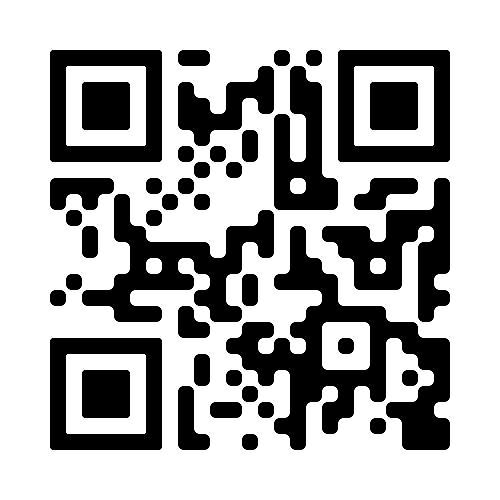

Dear love,

Do you know I still get butterflies when I touch your face, or when you look at me? I think I will get that forever, I love watching you get ready as I sit around, I love it when you look at me from time to time to ask if something looks good. Because of course it looks good baby, you look amazing. Nothing changed about your pretty eyes, I love to look at them, nothing changed about your pretty face. I still want to kiss it all over. I will always remain your admirer because of the type of person you are. I dream of a life with you, and its not a fairytale that I dream of. I want to add little things to your life, I want to live with you, I want to go to concerts, I want to take you to skateparks and we are gonna cook food together when we are home.

I will never run out of words for you. I don't know if I can form my words well, Diya. We met a while back now, as I write this letter on 12th of Feb, 6 months of our relationship has already passed by. I know there are some tension between me and you sometimes, sometimes you feel really guilty when I try to express myself clearly, I know you feel caged sometimes. We try our best to communicate through it all, and we get through it. There are a lot of things we need to work on, but that's what we have all our life for, right? And it was never gonna be easy. I have read it in books, I have heard it said in movies.. I never felt it truly as to why they say it. People say that staying with another human, it's usually not that easy. I don't know about other humans and what kind of love they had, I know about the girl I love.

You have no idea how easy it is for me to love you. You have no idea how my heart melts away when I am close to you, when I think about you.
Soon, it'll be one year of us agreeing that we actually love eachother. These next few years might be a bit of struggle before we can manage to make good money and start traveling or at least start living together. I wonder how life is gonna be when we live together. You are messy, I am messy too if you have seen my table. But surprisingly, I like cleaning your mess a lot more than I like cleaning mine. We say we know eachother fully, but when we start staying together, I am pretty sure we are gonna discover new small details about eachother.

I don't know what the future will be, but I do know that I have the sweetest girlfriend. I love this exact person that you are. I remember that night when we were with Kolaj, when we met for the first time and she called you over from the library. After a while you wanted to go and pee and also get your things and we walked back together, leaving Kolaj. That was the day I noticed you properly for the first time. I still remember that fuzzy feeling, I didn't know if we were gonna date or be something more than just two people who know eachother. I just wanted to be with you a little longer.

That is how you make me feel even now, almost one and half year of knowing you.

Happy 6th Month Anniversary Diya.
Happy Valentine's Day to us.

All I ever need in my life is you. And I mean it. I love you.

{width=40%}
